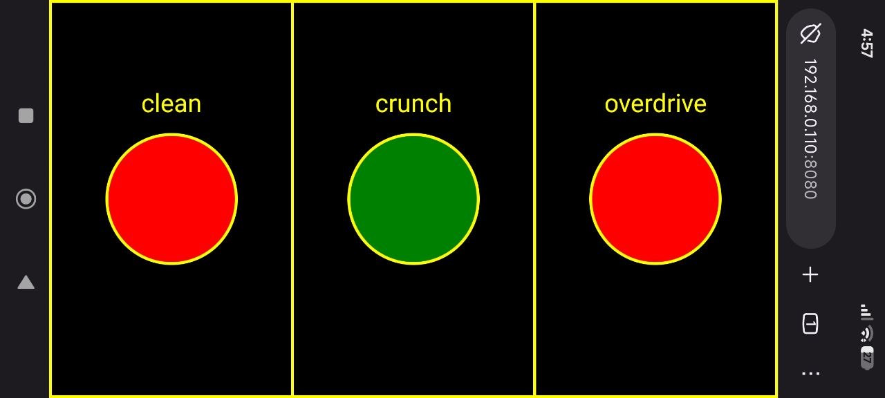
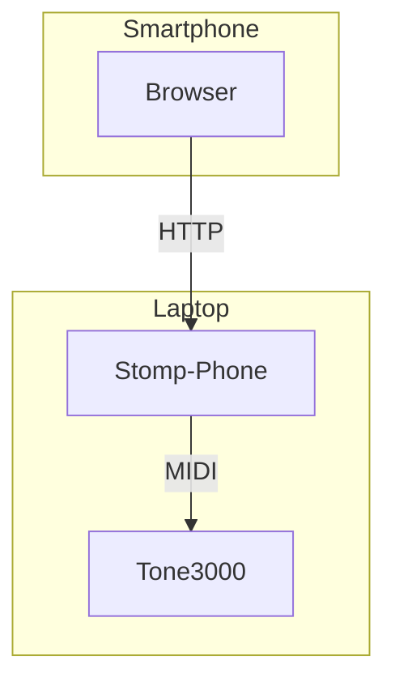

# stomp-phone

Use your smartphone as a MIDI footswitch


---

A simple app to serve an HTTP page with up to 3 buttons that issue MIDI commands to a virtual raw MIDI device.



It was created as a companion app for standalone [TONE3000 plugin](https://github.com/tone-3000/tone3000-plugin) to quickly switch between clean, crunch and overdrive profiles during bedroom jams. But it should work for any other plugin.



## 🗃️ Prerequisites

Enable virtual raw MIDI devices:

```sh
❯ sudo modprobe snd-virmidi

❯ amidi -l
Dir Device    Name
IO  hw:3,0    Virtual Raw MIDI (16 subdevices)
IO  hw:3,1    Virtual Raw MIDI (16 subdevices)
IO  hw:3,2    Virtual Raw MIDI (16 subdevices)
IO  hw:3,3    Virtual Raw MIDI (16 subdevices)

❯ ls -1 /dev/snd/midi*
/dev/snd/midiC3D0
/dev/snd/midiC3D1
/dev/snd/midiC3D2
/dev/snd/midiC3D3
```

## 📥 Installation

Download the app to your `PATH` and make it executable:

```sh
curl -sL https://github.com/hedgieinsocks/stomp-phone/releases/download/v0.2.1/stomp-phone-v0.2.1-linux-x64 -o ~/.local/bin/stomp-phone
chmod u+x ~/.local/bin/stomp-phone
```

## 🔧 Configuration

The application relies on a .yaml config file supplied by the user where they can declare up to 3 buttons. See [examples](examples/) for some common setups.

## 🚀 Usage

1. Launch the target application (e.g. TONE3000 plugin) and ensure it is listening to the chosen virtual raw MIDI device port.

2. Launch `stomp-phone` referencing the desired config:

```sh
❯ stomp-phone -f ~/.config/stomp-phone.yaml
```

3. Connect your smartphone to the same WI-FI network and open the URL printed in the previous step (e.g. http://192.168.0.110:8080).

## 📜 License

[MIT](LICENSE)
