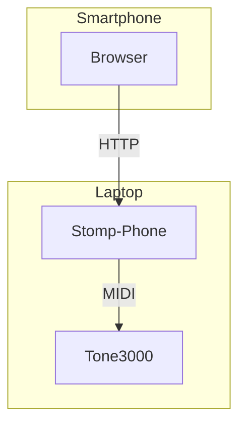

# stomp-phone

Use your smartphone as a MIDI footswitch.


A simple app to serve an HTTP page with 1-3 big buttons that issue MIDI commands.

It was created as a companion app for standalone [TONE3000 plugin](https://github.com/tone-3000/tone3000-plugin) to quickly switch back and forth between clean, crunch and overdrive profiles during bedroom jams. But it should work for any other plugin.




## 🗃️ Dependencies

Enable virtual raw MIDI devices.

```sh
❯ sudo modprobe snd-virmidi

❯ amidi -l
Dir Device    Name
IO  hw:3,0    Virtual Raw MIDI (16 subdevices)
IO  hw:3,1    Virtual Raw MIDI (16 subdevices)
IO  hw:3,2    Virtual Raw MIDI (16 subdevices)
IO  hw:3,3    Virtual Raw MIDI (16 subdevices)

❯ ls -1 /dev/snd/midi*
/dev/snd/midiC3D0
/dev/snd/midiC3D1
/dev/snd/midiC3D2
/dev/snd/midiC3D3
```

## 📥 Installation

Download the app to your `PATH` and make it executable.

```sh
curl -sL https://github.com/hedgieinsocks/stomp-phone/releases/download/v0.2.0/stomp-phone-v0.2.0-linux-x64 -o ~/.local/bin/stomp-phone
chmod u+x ~/.local/bin/stomp-phone
```

## 🚀 Usage

1. Create the configuration file.

```yaml
# ~/.config/stomp-phone.yaml
port: 8080
device: /dev/snd/midiC3D1
buttons:
  - caption: clean
    type: radio
    messageOn: C0 00
  - caption: crunch
    type: radio
    messageOn: C0 01
  - caption: overdrive
    type: radio
    messageOn: C0 02
```

You can declare 1-3 buttons. See [examples](examples/) for some common setups.

The `type` of each button can be one of the following:

* `radio` button behaves like a radio switch, so it requires at least two instances, most suited for switching between presets.
* `toggle` button behaves like a toggle switch with on/off states, so it requires `messageOff`, most suited for e.g. toggling a pedal in front of an amp.
* `click` button is stateless, most suited for selecting next/previous present, etc.

The `messageOn` and `messageOff` can be one of the following:

* Program Change (PC) hex MIDI message e.g. `C0 01` (for `PC# 1`)
* Control Change (CC) hex MIDI message e.g. `B0 01 7F` (for `CC# 1`)

The rest of the config is self-explanatory.

2. Launch the target application (e.g. TONE3000 plugin) and ensure it is listening to the chosen (in our example `hw:3,1`) virtual raw MIDI device port.

3. Launch `stomp-phone` referencing the created config.

```sh
❯ stomp-phone -f ~/.config/stomp-phone.yaml
```

4. Connect your smartphone to the same WI-FI network and open the URL printed in the previous step (e.g. http://192.168.0.110:8080).

5. Warm up your 🦶 and jam!

## 📜 License

[MIT](LICENSE)
